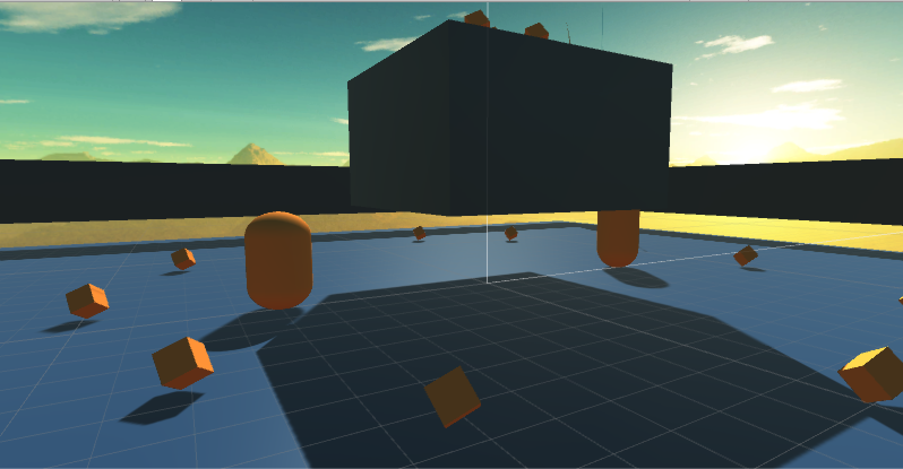

# TRY IT ONLINE: https://dl.dropboxusercontent.com/s/bw72s5ki62f933q/B0-Yan%20Kang.html 

# CONTROL
“W A S D” to control the left player, arrows to control the right player; left and right “shift”s are used to control jumping. Players can double jump.

Cube worth 10 points, collision to the other player or the wall would minus 1 point.

Start and reset buttons are provided.

Time will change to red within only 10 seconds remained.

If player drops off the plane, game end and the other wins.

Scores are shown on the top left and top right sides of the screen.

# FEATURE
Announcements are made when time’s up, player drops and player wins.

Camera dynamically follows both two players.

Time alert is shown in color.

The world background is changed with the skybox and direct light follows the nature way in the scene. 

