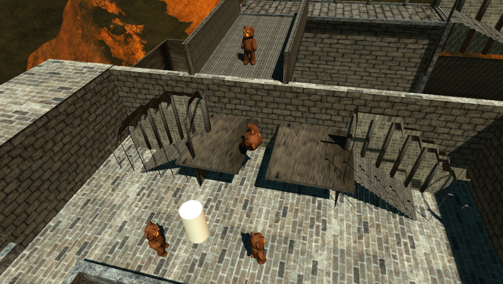

# [TRY IT ONLINE!] (https://dl.dropboxusercontent.com/s/wo9g31pao0uz8o1/Nav%26Ani.html) 

#Navigation and Animation
####Part1: Navigation

* **Agents** (capsule) can be selected by clicking the mouse and turn black when selected. When several agents are selected, click a destination by mouse and they will turn white again and move there automatically. 
* **Normal obstacles** (cubes) can be moved by arrow keys when selected (turn black) by mouse. 
* **Devils** (cylinders) are obstacles which move automatically.

####Part2: Animation

* The humanoid character (Teddy) can be moved by **WASD/arrows** for default walking forward and backward. 
* Press **left shift**, it will sprint; press space, it will jump. 
* In both walking and sprinting condition, the agent could turn right or left with the call of **horizonal axis value**.

####Part3: Coupling Navigation and Animation

* Similar to part1, agents could automatically go to the destination but the difference is that agents are animated according to the navigation.
* The selected bear can switch between run and walk by press and release **left shift**. It can also jump when meeting off mesh links (between different surfaces).

###### [MORE INFORMATION: CHECK OUR TEAM BLOGGER HERE.] ( http://graphicgroup12.blogspot.com) 
